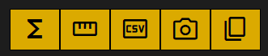

# Toolbar

The toolbar is the set of contextually-aware buttons at the top of the page.

Tools:

- [Calc Channels](./tools/calc_channels)
- [Measuring Tool](./tools/measuring_tool)
- [CSV export](./tools/data_export#csv-export)
- [Photo export](./tools/data_export#download)
- [Copy screenshot](./tools/data_export#copy-to-clipboard)
