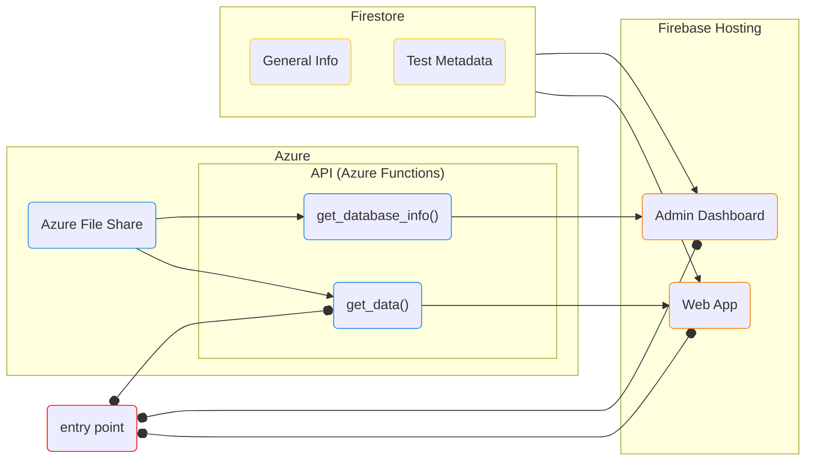
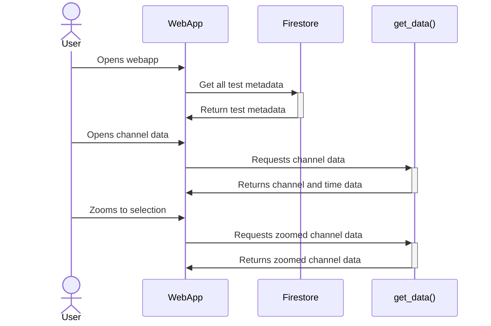
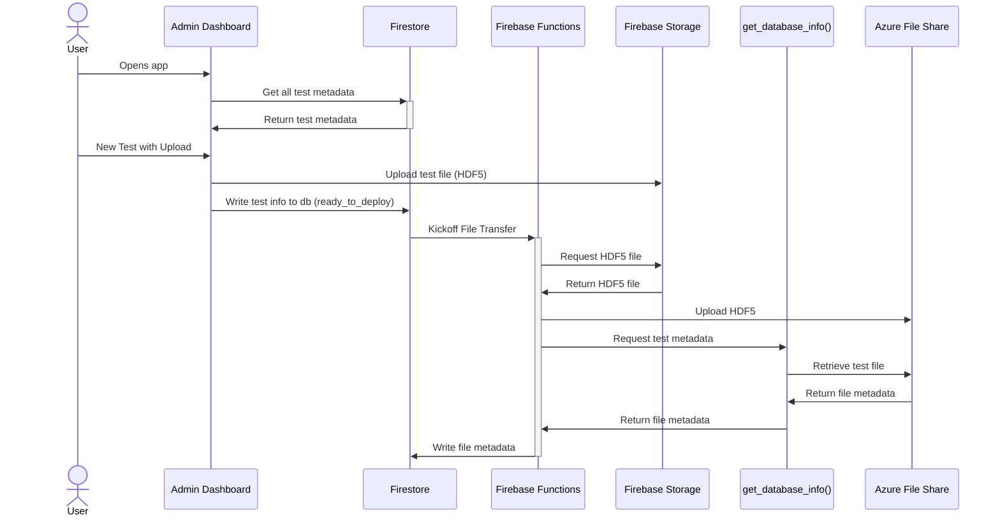
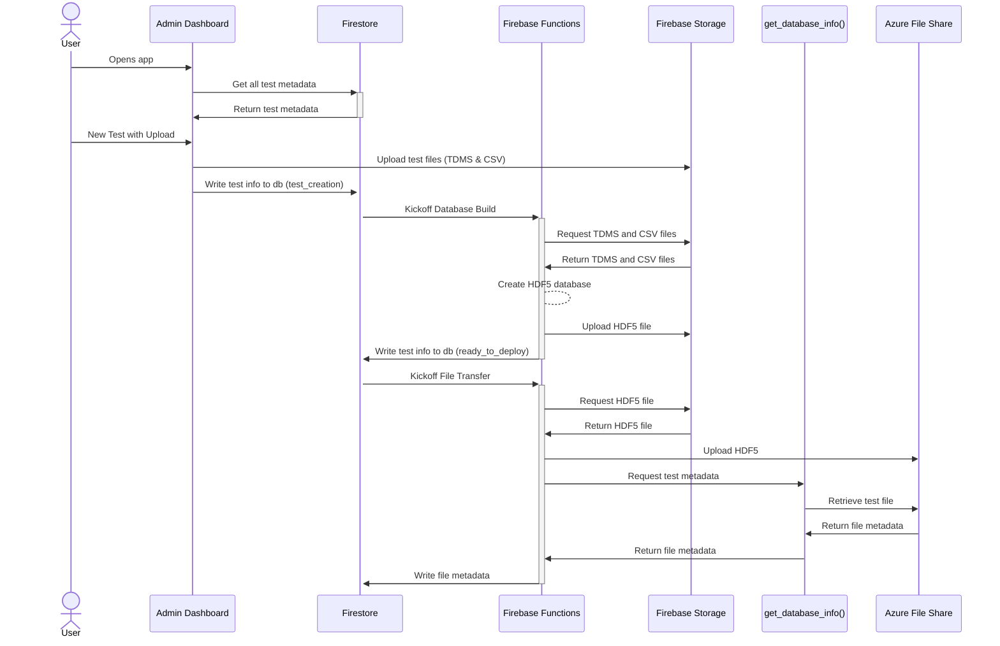

# Overarching Platform Architecture

```mermaid
flowchart LR
classDef red stroke:#f00
classDef azureColor stroke:#188ae5
classDef firebaseColor stroke:#f5820d
classDef firestoreColor stroke:#ffcb2b

webapp(Web App):::firebaseColor
admin(Admin Dashboard):::firebaseColor
getdata("get_data()"):::azureColor
getmetadata("get_database_info()"):::azureColor
entry(entry point):::red
azurefile(Azure File Share):::azureColor
generaldb(General Info):::firestoreColor
testdb(Test Metadata):::firestoreColor

subgraph Azure
azurefile --> getdata
azurefile --> getmetadata
subgraph "API (Azure Functions)"
getdata
getmetadata
end
end

subgraph Firestore
generaldb
testdb
end

subgraph "Firebase Hosting"
admin
webapp
end

entry o--o webapp
entry o--o admin
entry o--o getdata
getdata --> webapp
getmetadata --> admin
Firestore --> webapp
Firestore --> admin
```

# Data Flow: Webapp Interaction

```mermaid
sequenceDiagram
actor U as User
participant W as WebApp
participant f as Firestore
participant g as get_data()

U->>W: Opens webapp
W->>+f: Get all test metadata
f->>-W: Return test metadata

U->>W: Opens channel data
W->>+g: Requests channel data
g->>-W: Returns channel and time data

U->>W: Zooms to selection
W->>+g: Requests zoomed channel data
g->>-W: Returns zoomed channel data

```

# Data Flow: Create Test with HDF5 File

```mermaid
sequenceDiagram
actor usr as User
participant admin as Admin Dashboard
participant f as Firestore
participant f_fxn as Firebase Functions
participant storage as Firebase Storage
participant api as get_database_info()
participant azure as Azure File Share

usr->>admin: Opens app
admin->>+f: Get all test metadata
f->>-admin: Return test metadata

usr->>admin: New Test with Upload
admin->>storage: Upload test file (HDF5)
admin->>f: Write test info to db (ready_to_deploy)
f->>+f_fxn: Kickoff File Transfer
f_fxn->>storage: Request HDF5 file
storage->>f_fxn: Return HDF5 file
f_fxn->>azure: Upload HDF5
f_fxn->>api: Request test metadata
api->>azure: Retrieve test file
azure->>api: Return file metadata
api->>f_fxn: Return file metadata
f_fxn->>-f: Write file metadata
```

# Data Flow: Create Test with TDMS and CSV Files

```mermaid
sequenceDiagram
actor usr as User
participant admin as Admin Dashboard
participant f as Firestore
participant f_fxn as Firebase Functions
participant storage as Firebase Storage
participant api as get_database_info()
participant azure as Azure File Share

usr->>admin: Opens app
admin->>+f: Get all test metadata
f->>-admin: Return test metadata

usr->>admin: New Test with Upload
admin->>storage: Upload test files (TDMS & CSV)
admin->>+f: Write test info to db (test_creation)
f->>+f_fxn: Kickoff Database Build
f_fxn->>storage: Request TDMS and CSV files
storage->>f_fxn: Return TDMS and CSV files
f_fxn-->f_fxn: Create HDF5 database
f_fxn->>storage: Upload HDF5 file
f_fxn->>-f: Write test info to db (ready_to_deploy)

f->>+f_fxn: Kickoff File Transfer
f_fxn->>storage: Request HDF5 file
storage->>f_fxn: Return HDF5 file
f_fxn->>azure: Upload HDF5
f_fxn->>api: Request test metadata
api->>azure: Retrieve test file
azure->>api: Return file metadata
api->>f_fxn: Return file metadata
f_fxn->>-f: Write file metadata
```
