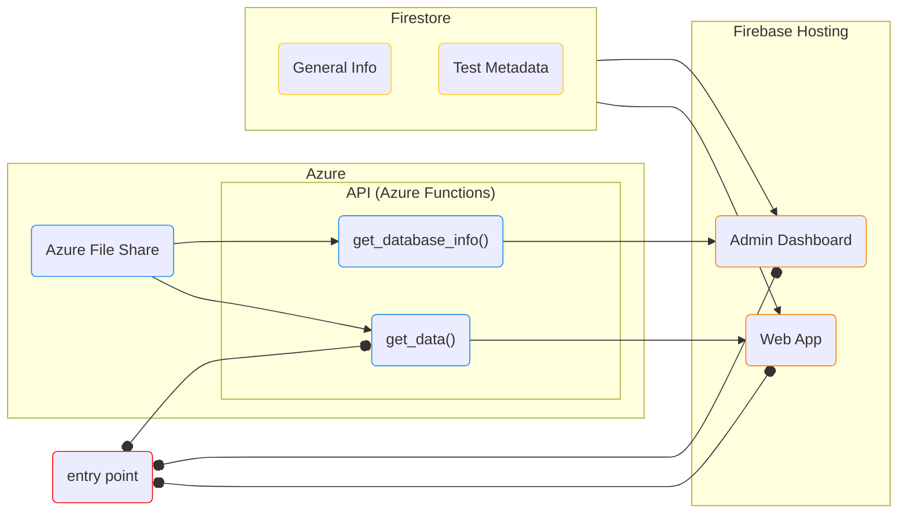
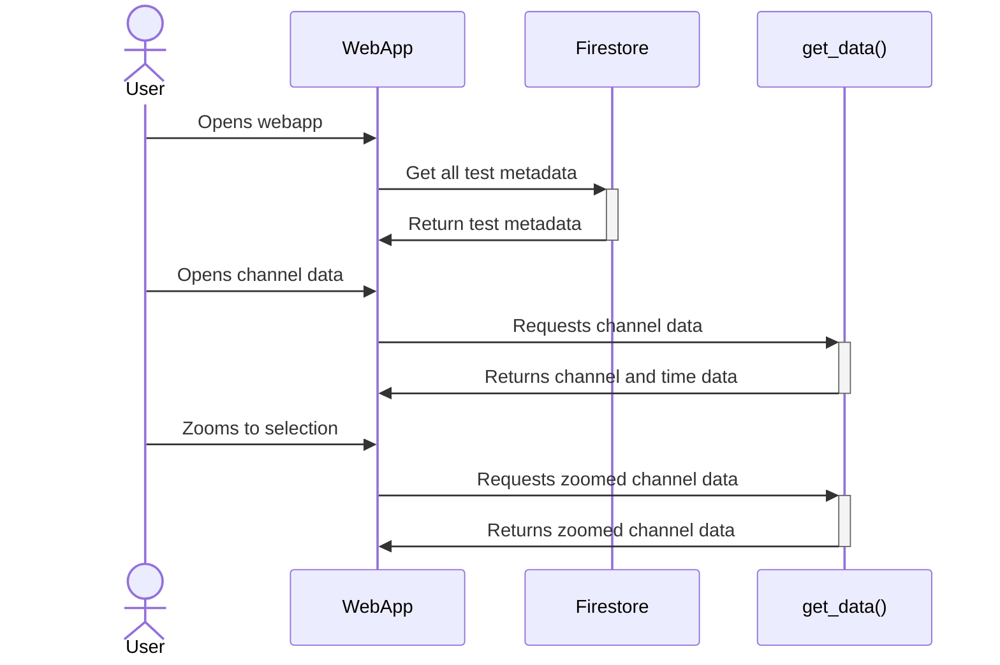
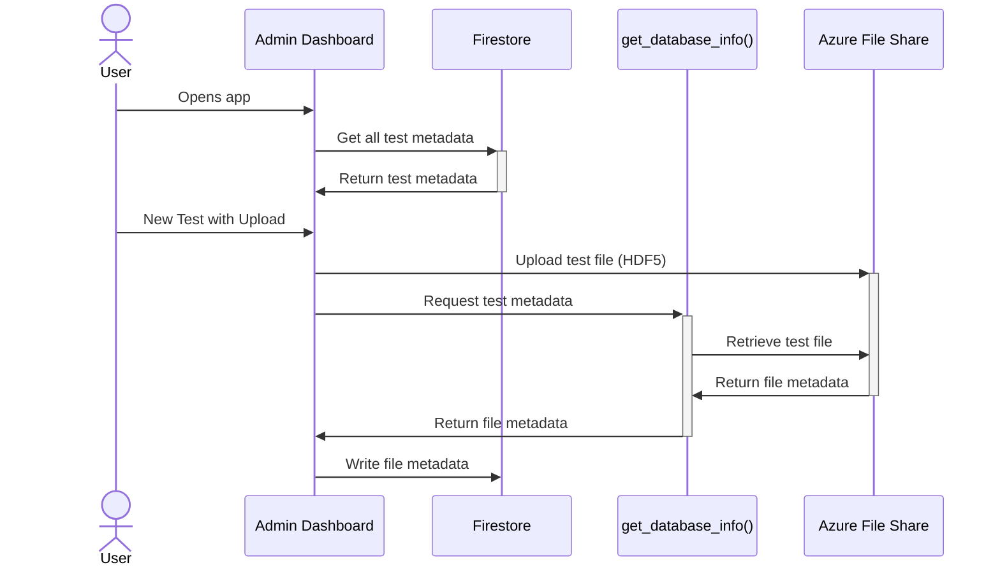

# Overarching Platform Architecture

```mermaid
flowchart LR
classDef red stroke:#f00
classDef azureColor stroke:#188ae5
classDef firebaseColor stroke:#f5820d
classDef firestoreColor stroke:#ffcb2b

webapp(Web App):::firebaseColor
admin(Admin Dashboard):::firebaseColor
getdata("get_data()"):::azureColor
getmetadata("get_database_info()"):::azureColor
entry(entry point):::red
azurefile(Azure File Share):::azureColor
generaldb(General Info):::firestoreColor
testdb(Test Metadata):::firestoreColor

subgraph Azure
azurefile --> getdata
azurefile --> getmetadata
subgraph "API (Azure Functions)"
getdata
getmetadata
end
end

subgraph Firestore
generaldb
testdb
end

subgraph "Firebase Hosting"
admin
webapp
end

entry o--o webapp
entry o--o admin
entry o--o getdata
getdata --> webapp
getmetadata --> admin
Firestore --> webapp
Firestore --> admin
```

# Data Flow: Webapp Interaction

```mermaid
sequenceDiagram
actor U as User
participant W as WebApp
participant f as Firestore
participant g as get_data()

U->>W: Opens webapp
W->>+f: Get all test metadata
f->>-W: Return test metadata

U->>W: Opens channel data
W->>+g: Requests channel data
g->>-W: Returns channel and time data

U->>W: Zooms to selection
W->>+g: Requests zoomed channel data
g->>-W: Returns zoomed channel data

```

# Data Flow: Create Test

```mermaid
sequenceDiagram
actor U as User
participant W as Admin Dashboard
participant f as Firestore
participant G as get_database_info()
participant A as Azure File Share

U->>W: Opens app
W->>+f: Get all test metadata
f->>-W: Return test metadata

U->>W: New Test with Upload
W->>+A: Upload test file (HDF5)
W->>+G: Request test metadata
G->>A: Retrieve test file
A->>-G: Return file metadata
G->>-W: Return file metadata
W->>f: Write file metadata

```
